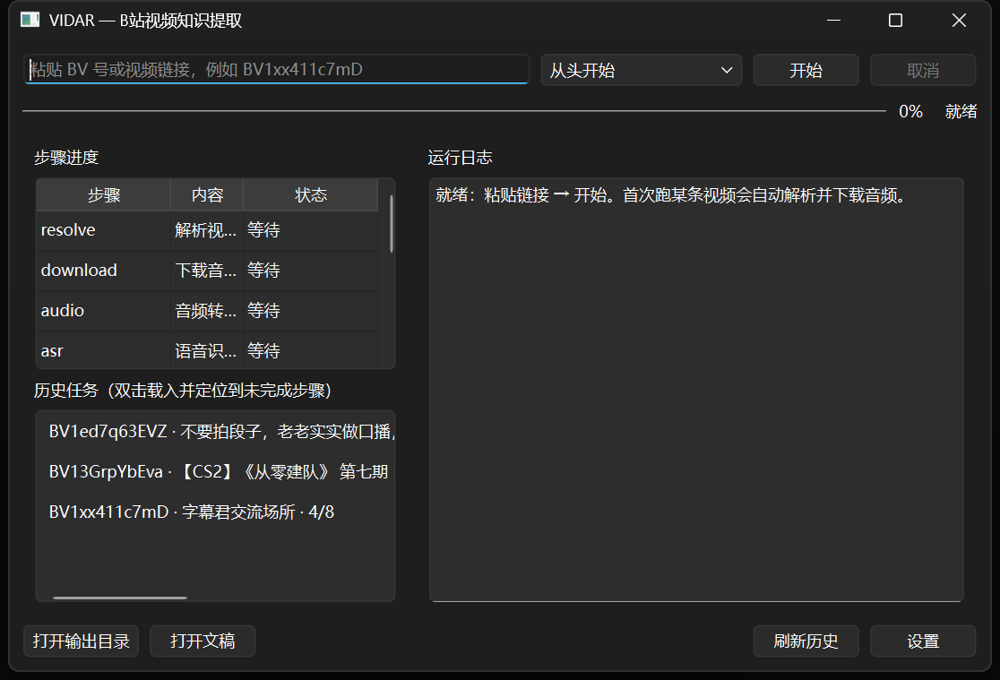

<div align="center">

# VIDAR

**Ginyva's VIDAR** · 中文音译「维达」（取「视频达意」）

把 B 站视频变成可读、可检索、可追溯的 Markdown 知识文档

[](https://github.com/GinyvaXu/VIDAR/actions/workflows/ci.yml)
[](LICENSE)
[](pyproject.toml)
[]()

</div>

---

## 它是什么

输入一条 B 站视频链接，输出一套结构化知识文档：

```text
BV链接 → 解析视频信息 → 下载（仅音频） → 语音识别（ASR）
      → 原始逐字稿 → LLM 段级精修稿 → 分章节目录 → 结构化摘要
      → Markdown 大纲 → 知识库导出（notes.md / outline.md / 逐字稿 / meta.json）
```

**示例产物**（来自真实 22 分钟视频，点击查看）：

- [notes.md — 摘要 + 核心要点 + 章节导航 + 章节小结](docs/examples/notes-example.md)
- [outline.md — Markdown 大纲](docs/examples/outline-example.md)



## 特性

- 🎙️ **本地语音识别**：faster-whisper `large-v3`（CUDA），词级时间戳 + VAD 防幻觉 + 幻听短语过滤
- ✂️ **段级精修**：LLM 纠正错别字、去口水词、统一术语；段号与时间戳 1:1 保留，**原文 + 精修双版本可追溯**
- 🧠 **结构化总结**：map-reduce 生成「一句话结论 + 核心要点 + 章节小结」，要点可点击跳回 B 站对应时间
- 📝 **知识库导出**：`notes.md`（带 frontmatter，兼容 Obsidian）/ `outline.md` / 逐字稿 / `meta.json`（含 token 统计）
- 🖥️ **图形界面**：步骤进度、实时日志、历史任务续跑、设置面板（PySide6）
- 🔁 **断点续跑**：8 步状态机，取消/崩溃后随时续传，已完成步骤自动跳过
- 📦 **便携版**：GUI + CLI 双 exe，内置 CUDA 运行时与 ffmpeg，双击即用
- 🔌 **模型自由**：任意 OpenAI 兼容 LLM（OpenCode Go / DeepSeek / SiliconFlow / Ollama…）

## 快速开始

前置：Windows（推荐）或 Linux、[uv](https://docs.astral.sh/uv/)、NVIDIA 显卡（推荐，无独显自动回退 CPU）

```powershell
# 1. 安装依赖（asr = 语音识别，gui = 图形界面）
uv sync --extra asr --extra gui

# 2. 环境自检（依赖 / GPU / 模型 / API 连通性）
uv run vidar doctor --net

# 3. 下载 ASR 模型（约 3.1GB，见下节）
uv run vidar model download large-v3

# 4. 开始使用
uv run vidar gui                                     # 图形界面
uv run vidar run "BV1xx411c7mD"                      # CLI 全流程
uv run vidar run "BV1xx411c7mD" --from refine        # 从中间步骤续跑
```

> `ffmpeg` 无需手动安装：`uv sync --extra asr` 会附带静态版 ffmpeg（有系统 ffmpeg 时优先用系统版）。

### 便携版（Windows，免环境）

```powershell
powershell -ExecutionPolicy Bypass -File scripts\build_portable.ps1 -Archive
```

构建产物（约 2.4GB，内置 CUDA 运行时 / ffmpeg / Qt）：`versions/vX.Y.Z/dist/VIDAR-vX.Y.Z-win64-portable/`
内含 `VIDAR.exe`（GUI）、`VIDAR-CLI.exe`（命令行）、`config.toml`、`使用说明.txt`。

## 模型下载（必须一次，约 3.1GB）

### 方式 A：辅助命令（推荐）

```powershell
uv run vidar model download large-v3     # 分片并行 + 断点续传 + 自动校验（默认 hf-mirror 源）
uv run vidar model check large-v3        # 随时校验文件完整性（大小逐一比对）
uv run vidar model download large-v3 --source huggingface   # 直连官方源
```

### 方式 B：手动下载（与作者相同的方式）

浏览器/下载器下载下面 5 个文件，放入模型目录，然后校验：

| 文件 | 大小（字节） | 直链（hf-mirror） |
|------|-------------|-------------------|
| `model.bin` | 3,087,284,237 | https://hf-mirror.com/Systran/faster-whisper-large-v3/resolve/main/model.bin |
| `config.json` | 2,394 | https://hf-mirror.com/Systran/faster-whisper-large-v3/resolve/main/config.json |
| `tokenizer.json` | 2,480,617 | https://hf-mirror.com/Systran/faster-whisper-large-v3/resolve/main/tokenizer.json |
| `vocabulary.json` | 1,068,114 | https://hf-mirror.com/Systran/faster-whisper-large-v3/resolve/main/vocabulary.json |
| `preprocessor_config.json` | 340 | https://hf-mirror.com/Systran/faster-whisper-large-v3/resolve/main/preprocessor_config.json |

- 文件浏览页：<https://hf-mirror.com/Systran/faster-whisper-large-v3/tree/main>（官方源把域名换成 `huggingface.co`）
- 目标目录：`models/faster-whisper-large-v3/`（源码运行 / 便携版程序目录下均可）
- **校验方式**：`uv run vidar model check large-v3`（逐文件比对大小）；`uv run vidar doctor` 也会自动校验
- 其他档位：`large-v3-turbo`（更快）、`medium`、`small`，把命令里的模型名换掉即可
- 网络提示：HuggingFace 官方源在国内可能被 xet 传输卡住，建议用 `hf-mirror`（默认）或手动下载

配置指向（二选一）：
- 模型放在 `models/faster-whisper-large-v3/` 时**自动识别**（无需配置）
- 或显式指定：`config.toml` → `[asr] model = "<模型目录绝对路径>"`

## 配置

优先级：**CLI 参数 > 环境变量 > config.toml > 默认值**

```powershell
uv run vidar config init     # 生成用户配置文件
uv run vidar config show     # 查看生效配置（密钥掩码）
```

常用环境变量：

| 变量 | 说明 |
|------|------|
| `VIDAR_LLM_API_KEY` | LLM 密钥（也兼容 `OPENAI_API_KEY`、`OPENCODE_GO_API_KEY`） |
| `VIDAR_LLM_API_BASE` | LLM 端点（也兼容 `OPENAI_BASE_URL`），如 `https://api.deepseek.com/v1` |
| `VIDAR_LLM_MODEL` | 模型名，如 `deepseek-chat` |
| `VIDAR_ASR_MODEL` / `VIDAR_ASR_DEVICE` | ASR 模型 / 设备（`auto｜cuda｜cpu`） |
| 嵌套写法 | `VIDAR_ASR__MODEL=large-v3`（双下划线表示层级） |

<details>
<summary>config.toml 示例</summary>

```toml
[asr]
model = "C:/path/to/models/faster-whisper-large-v3"   # 或留 "large-v3" 自动查找 models/
device = "auto"
hf_endpoint = "https://hf-mirror.com"

[llm]
api_base = "https://opencode.ai/zen/go/v1"   # 任意 OpenAI 兼容端点
api_key = ""                                  # 推荐用环境变量
model = "deepseek-v4.1-flash"
```
</details>

## 使用

### CLI

| 命令 | 说明 |
|------|------|
| `vidar run <BV号/URL>` | 全流程：解析 → 下载 → 识别 → 精修 → 章节 → 摘要 → 导出 |
| `vidar run <BV> --from <步骤>` | 从指定步骤续跑（断点恢复） |
| `vidar run <BV> --to <步骤>` | 只跑到指定步骤 |
| `vidar run <BV> --keep-media` | 保留音视频文件（默认处理完自动清理） |
| `vidar model download/check` | 模型下载 / 校验 |
| `vidar doctor --net` | 环境自检（含 B 站与 LLM API 连通性） |
| `vidar config init/show` | 配置管理 |
| `vidar gui` | 图形界面 |

### 输出结构

```text
output/20260626_BV1ed7q63EVZ_视频标题/
├── notes.md               # 主文档：一句话结论 + 核心要点 + 章节导航 + 章节小结
├── outline.md             # Markdown 大纲（要点按章节归属）
├── transcript.raw.md      # 原始逐字稿（带时间戳，保口语原貌）
├── transcript.refined.md  # 精修稿（去口水词 / 纠错 / 术语规范）
└── meta.json              # 处理记录（引擎 / 模型 / token 用量）
```

中间产物保存在 `work/<BV号>/`（JSON 格式，可续跑 / 可调试），日志在 `logs/`。

## 常见问题

<details>
<summary>视频下载失败 / 只能下低清晰度？</summary>

音频流通常无需登录；遇到限制时在 `config.toml` 配置 `[paths] cookies = "cookies.txt"` 路径（浏览器插件导出 Netscape 格式即可）。
</details>

<details>
<summary>识别太慢？</summary>

`large-v3` 在 RTX 5060 笔记本上约 3.8x 实时（22 分钟视频 ≈ 6 分钟）。追求速度换 `large-v3-turbo`（快 2-3 倍，质量接近）：
`uv run vidar run <BV> --asr-model large-v3-turbo`
</details>

<details>
<summary>报错 cublas64_12.dll / cudnn 相关？</summary>

`uv sync --extra asr` 已随包安装 CUDA 运行时并自动注册搜索路径，正常不会出现；若手动装过旧版依赖，重新 `uv sync --extra asr` 即可。
</details>

<details>
<summary>模型下载卡住 / 很慢？</summary>

优先用 `vidar model download large-v3`（hf-mirror + 分片并行 + 断点续传），或按上文链接手动下载后用 `vidar model check` 校验。
</details>

<details>
<summary>LLM 报错 / 想换模型？</summary>

任何 OpenAI 兼容服务均可：OpenCode Go（`https://opencode.ai/zen/go/v1`）、DeepSeek（`https://api.deepseek.com/v1`）、Ollama 等。在 `config.toml` 或图形界面「设置」中修改。
</details>

## 合规声明

- 本项目**仅供个人学习与研究**使用；请遵守 B 站用户协议与相关版权法律法规
- 不绕过付费/大会员内容，不高频批量抓取，不提供内容分发能力
- 下载的内容请勿传播；由使用者自行承担合规责任

## 致谢

- 设计思路参考了 [VideoCaptioner](https://github.com/WEIFENG2333/VideoCaptioner)（仅借鉴设计，独立实现）
- 依赖：[yt-dlp](https://github.com/yt-dlp/yt-dlp)、[faster-whisper](https://github.com/SYSTRAN/faster-whisper)、[CTranslate2](https://github.com/OpenNMT/CTranslate2)、[PySide6](https://www.qt.io/)、[Typer](https://typer.tiangolo.com/)、[Rich](https://github.com/Textualize/rich)

## License

[MIT](LICENSE) © 2026 GinyvaXu
